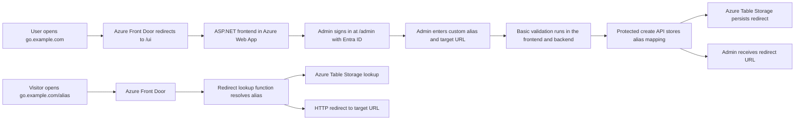
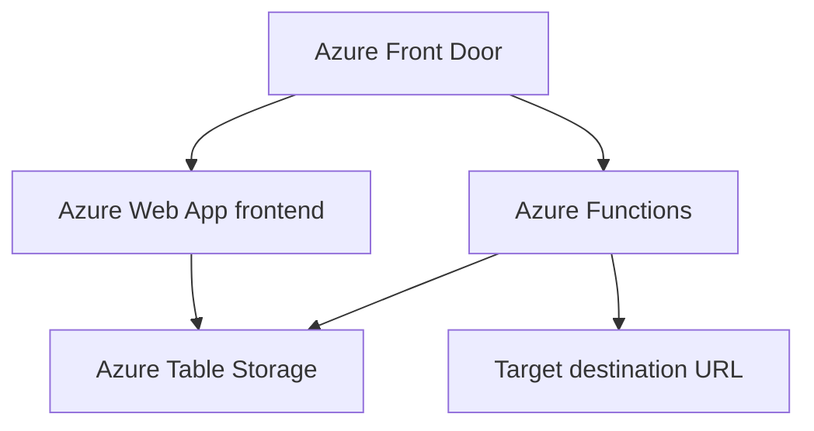

# URL Redirect

> Fast, simple, and cost conscious link redirects on Azure

## ✨ Scope

This project provides a simple Azure hosted URL redirect service.

A user opens the main web address and creates a new redirect by entering:

1. A custom alias
2. A target URL

After a successful submission, the user receives a redirect URL such as `https://go.example.com/my-alias`.

Anyone who opens that redirect URL is sent to the configured target URL through a fast and cost conscious redirect path.

## 🎯 Functional Goals

- Provide a public landing page under `/ui`
- Restrict redirect creation to authenticated administrators under `/admin`
- Support custom aliases
- Validate alias and target URL input
- Return the final redirect URL immediately after creation
- Resolve redirects efficiently for public traffic
- Keep infrastructure simple and low cost by default

## 🏗️ Solution Architecture

The solution is built from a small set of Azure services:

- 🌐 **ASP.NET frontend** hosted as an **Azure Web App** for the public `/ui` landing page and protected `/admin` console
- ⚡ **Azure Functions** for redirect lookup
- 🗂️ **Azure Table Storage** for low cost persistence of alias and target URL mappings
- 🚪 **Azure Front Door** as an optional edge entry point for unified routing in production
- 🔐 **Microsoft Entra ID** for administrator authentication and authorization

### User Flow Diagram

### Solution Architecture Diagram

## 🔄 Request Flow

### 📝 Create flow

1. The user opens the root web address.
2. Azure Front Door redirects `/` to `/ui`.
3. An administrator signs in through Microsoft Entra ID.
4. The protected admin page shows a form with alias and target URL fields.
5. Basic validation checks that the alias is allowed and that the target is a valid URL.
6. The protected backend stores the redirect definition.
7. The system returns the final redirect URL to the administrator.

### 🚀 Redirect flow

1. A visitor opens the redirect URL at `/{alias}`.
2. In local or server-hosted runs, the ASP.NET web host can resolve `/{alias}` directly against the shared repository.
3. In the target Azure deployment, Azure Front Door can send `/ui`, `/admin`, `/ui/assets/*`, and `/api/*` to the Web App, and the remaining root paths to redirect lookup.
4. Azure Functions resolves the alias from Table Storage.
5. The platform returns the redirect response to the visitor.

## 💡 Design Choices

- Table Storage is the default persistence layer because the data model is simple and cost sensitive.
- Azurite is the standard local development path so the app uses the real Table Storage code path without requiring Azure resources.
- Front Door improves latency and reduces backend load for frequently used links.
- The create UI lives under `/ui` so alias routes can stay clean at the root hostname.
- The admin console lives under `/admin` and is protected by Microsoft Entra ID plus the app's `AdminOnly` policy.
- Durable Functions are not required for the initial scope.

## 📘 Documentation

- V1 contract: [docs/v1-contract.md](docs/v1-contract.md)
- Local development with Azurite: [docs/local-development.md](docs/local-development.md)
- Azure deployment with Bicep: [docs/azure-deployment.md](docs/azure-deployment.md)
- Microsoft Entra ID admin auth: [docs/entra-auth.md](docs/entra-auth.md)
- Infrastructure validation script: [infra/validate-infra.ps1](infra/validate-infra.ps1)
- Infrastructure validation script for macOS/Linux: [infra/validate-infra.sh](infra/validate-infra.sh)

## 📦 Initial Boundaries

This first version focuses on redirect creation and fast redirect delivery.

The following items are intentionally out of scope for the initial implementation:

- Advanced analytics
- Bulk import
- Complex user management
- Approval workflows
- Scheduled background processes unless a later requirement needs them

## 🧭 At A Glance

| Area     | Choice                           |
|----------|----------------------------------|
| Frontend | ASP.NET in Azure Web App         |
| Backend  | ASP.NET Web App + Azure Functions |
| Storage  | Azure Table Storage              |
| Edge     | Azure Front Door optional        |
| Goal     | Fast redirects at low cost       |
