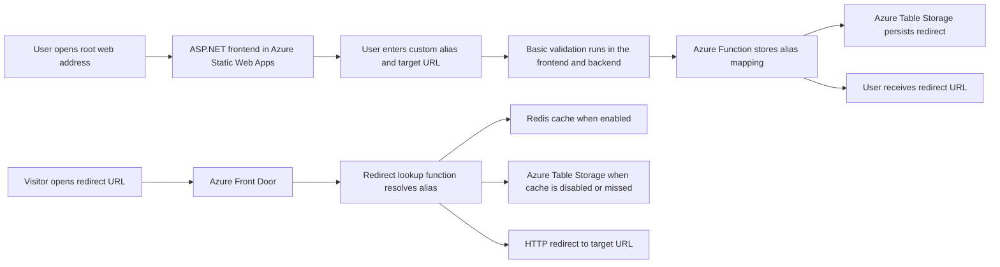
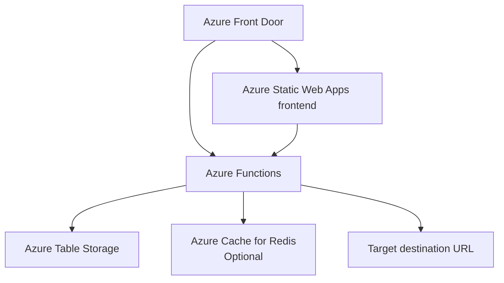

# URL Redirect

> Fast, simple, and cost conscious link redirects on Azure

## ✨ Scope

This project provides a simple Azure hosted URL redirect service.

A user opens the main web address and creates a new redirect by entering:

1. A custom alias
2. A target URL

After a successful submission, the user receives a redirect URL such as `https://go.example.com/my-alias`.

Anyone who opens that redirect URL is sent to the configured target URL through a fast and cost conscious redirect path.

## 🎯 Functional Goals

- Allow users to create redirects through an ASP.NET frontend hosted as a stateless Azure Static Web App
- Support custom aliases
- Validate alias and target URL input
- Return the final redirect URL immediately after creation
- Resolve redirects efficiently for public traffic
- Keep infrastructure simple and low cost by default

## 🏗️ Solution Architecture

The solution is built from a small set of Azure services:

- 🌐 **ASP.NET frontend** hosted as a stateless **Azure Static Web App** for the create redirect page and basic validation
- ⚡ **Azure Functions** for redirect creation and redirect lookup
- 🗂️ **Azure Table Storage** for low cost persistence of alias and target URL mappings
- 🚪 **Azure Front Door** for global entry and edge caching of redirect responses
- 🔴 **Azure Cache for Redis** as an optional performance layer that can be turned on or off

### User Flow Diagram

### Solution Architecture Diagram

## 🔄 Request Flow

### 📝 Create flow

1. The user opens the root web address.
2. The frontend shows a form with alias and target URL fields.
3. Basic validation checks that the alias is allowed and that the target is a valid URL.
4. The frontend calls a backend function to store the redirect definition.
5. The system returns the final redirect URL to the user.

### 🚀 Redirect flow

1. A visitor opens the redirect URL.
2. Azure Front Door receives the request and serves cached responses when possible.
3. On cache miss, Azure Functions resolves the alias.
4. The function reads from Redis when enabled, otherwise from Table Storage.
5. The function returns the redirect response to the visitor.

## 💡 Design Choices

- Table Storage is the default persistence layer because the data model is simple and cost sensitive.
- Redis stays optional so the platform can run cheaply at low traffic levels.
- Front Door improves latency and reduces backend load for frequently used links.
- Durable Functions are not required for the initial scope.

## 📘 Documentation

- V1 contract: [docs/v1-contract.md](docs/v1-contract.md)

## 📦 Initial Boundaries

This first version focuses on redirect creation and fast redirect delivery.

The following items are intentionally out of scope for the initial implementation:

- Advanced analytics
- Bulk import
- Complex user management
- Approval workflows
- Scheduled background processes unless a later requirement needs them

## 🧭 At A Glance

| Area     | Choice                           |
|----------|----------------------------------|
| Frontend | ASP.NET in Azure Static Web Apps |
| Backend  | Azure Functions                  |
| Storage  | Azure Table Storage              |
| Cache    | Redis optional                   |
| Edge     | Azure Front Door                 |
| Goal     | Fast redirects at low cost       |
